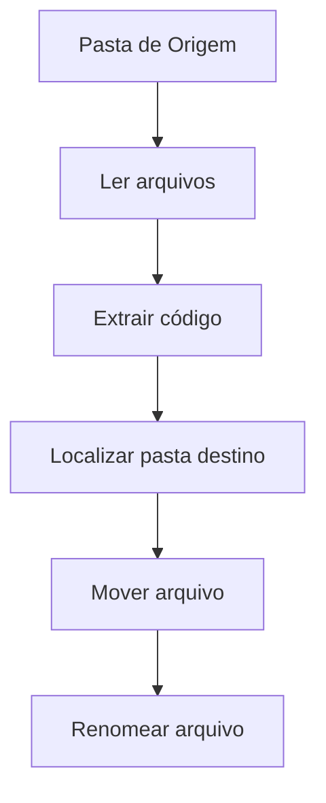

# 📂 Gerenciador de Arquivos


Aplicação desktop desenvolvida em **Python + Tkinter** para automatizar a organização de arquivos com base em códigos presentes no nome.

---

## 🚀 Funcionalidades

✔ Organização automática de arquivos

✔ Suporte a PDF, XML, pastas ou todos os arquivos

✔ Identificação de código no nome do arquivo

✔ Movimentação inteligente para pastas correspondentes

✔ Renomeação opcional

✔ Interface gráfica simples e intuitiva

✔ Barra de progresso em tempo real

✔ Console integrado para logs

---

## 🧠 Como funciona



---

## ⚙️ Configurações disponíveis

* 📍 Local do código no nome:

  * Início → `123_arquivo.pdf`
  * Fim → `arquivo_123.pdf`

* 🔢 Quantidade de caracteres do código:

  * Ex: `3` → código = `123`

---

## 📌 Parâmetros da aplicação

| Campo              | Descrição                          |
| ------------------ | ---------------------------------- |
| Tipo de arquivo    | PDF, XML, Pasta ou Tudo            |
| Pasta de origem    | Onde estão os arquivos             |
| Pasta de destino   | Onde estão as pastas organizadoras |
| Caminho do arquivo | Subpasta opcional                  |
| Renomear arquivos  | Novo nome padrão opcional          |

---

## 📊 Exemplo prático

### Entrada:

```
/origem
├── 123_nota.pdf
├── 456_recibo.pdf
```

```
/destino
├── 123/
├── 456/
```

### Saída:

```
/destino
├── 123/123_nota.pdf
├── 456/456_recibo.pdf
```

---

## ▶️ Como executar

```bash
git clone https://github.com/MGS-BR/Gerenciamento-de-Arquivos.git
cd Gerenciamento-de-Arquivos
python main.py
```

---

## 🛠️ Tecnologias

* Python 3
* Tkinter
* pathlib
* shutil
* threading

---

## 🔍 Validações

✔ Pasta de origem existe

✔ Pasta de destino existe

✔ Ambos são diretórios válidos

✔ Campos obrigatórios preenchidos

---

## 📈 Logs e Progresso

* ✔ Total de arquivos processados
* ✔ Arquivos movidos
* ✔ Arquivos com erro
* ✔ Arquivos sem destino
* ✔ Barra de progresso dinâmica

---

## 📄 Licença

Este projeto está sob a licença MIT.
